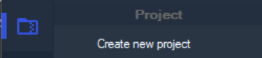
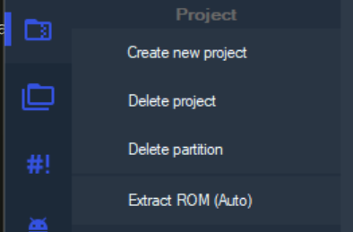
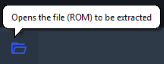
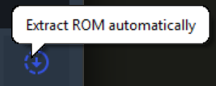

Great.

I expect you to have crb installed now.

I hope its open as well.

In this tutorial we will be mainly focusing on an Note 10+, Exynos 9825 porting to an S23 FE, Exynos 2200 Firmware.

We simply begin by extracting both firmwares.

Create a new project and give at an name, so you can always easily tell the difference.

 

click on this icon so we can continue.

click on Extract ROM (Auto)

add the rom.zip you downloaded.

Let this run through and redo this tutorial, but with the other firmware. 

Yes, you also create a new project.

If that is done:

- select rom to port to

- go to "✨" on the left side
 
- hit orange icon next to partition name

- hit "convert to ext4" 

# Next up:

## [Step Two: Get Partition Sizes](./prtsiz.md)

# Previous:

## [Readme.md](./README.md)